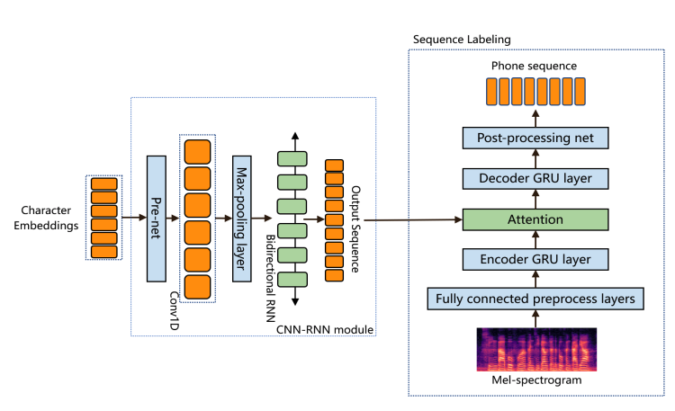

### Method

I implemented the system in the [SED-MDD paper](https://ieeexplore.ieee.org/document/9052975). Architecture is shown below.

Modifications: The original SED-MDD system performs frame-wise phoneme prediction, in a fashion similar to an acoustic model. However I found that the predicted phonemes were quite noisy and could not match the results reported in the paper. Here I'm using a **CTC** loss to replace the original sequence labeling module. Also, I replace the Mel input representations with [Wav2vec 2.0](https://arxiv.org/abs/2006.11477) representations. The Wav2vec 2.0 representations were extracted from a model which was unsupervisedly pre-trained on Librispeech and fine-tuned on the full 960 hours Librispeech audio.

### Dataset

I use [TIMIT](https://github.com/philipperemy/timit) and [L2-ARCTIC](https://psi.engr.tamu.edu/l2-arctic-corpus/), following the train/test split in SED-MDD.

### Results (Audio Samples)

Take a look at the audio samples below!

[Audio samples html page](https://mu-y.github.io/speech_samples/mpd_l2arctic/l2arctic_chinese.html)

### Acknowledgement

This project is a collaboration with [Shaojin Ding](https://psi.engr.tamu.edu/people/shaojin-ding/). The code was adapted from Shaojin Ding's initial implementation.

